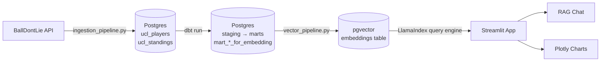

# UCL RAG Pipeline ⚽

This project builds an end to end RAG pipeline over UEFA Champions League data. It pulls player and standings data from the BallDontLie API, loads it into PostgreSQL with pgvector, transforms it with dbt, generates vector embeddings via Mistral AI using LlamaIndex, and exposes a Streamlit chat UI where you can ask natural-language questions about UCL players and teams  alongside preset Plotly charts.

## Architecture

## Tech Stack

| Layer | Technology |
|---|---|
| Data ingestion | Python, Requests, pandas, SQLAlchemy |
| Database | PostgreSQL + pgvector |
| Transformations | dbt |
| Embeddings + LLM | Mistral AI (`mistral-embed`, `open-mistral-nemo`) |
| Vector index | LlamaIndex |
| Frontend | Streamlit, Plotly |
| Infrastructure | Docker Compose |

## Design Decisions

- **Custom `MistralSessionEmbedding` class** — the default LlamaIndex Mistral client doesn't expose retry control. Routing through a `requests.Session` with `HTTPAdapter` + `Retry` gives us exponential backoff on 429s, which is essential for bulk embedding runs.

- **dbt mart layer shaped for embedding** — the `mart_*_for_embedding` views produce a single `embedding_text` column per row. This keeps embedding logic out of Python and in SQL where it's testable and version-controlled.

- **`sanitize()` function** — the BallDontLie API returns nested JSON objects (e.g. `team: {id, name}`). `sanitize()` flattens dicts into dot-separated columns and serializes lists to JSON strings before writing to Postgres, avoiding schema errors without needing manual column mapping.

- **pgvector co-located with relational data** — storing vectors in the same Postgres instance as the raw and transformed tables removes an infrastructure dependency and makes `make up` sufficient to run the full stack locally.
